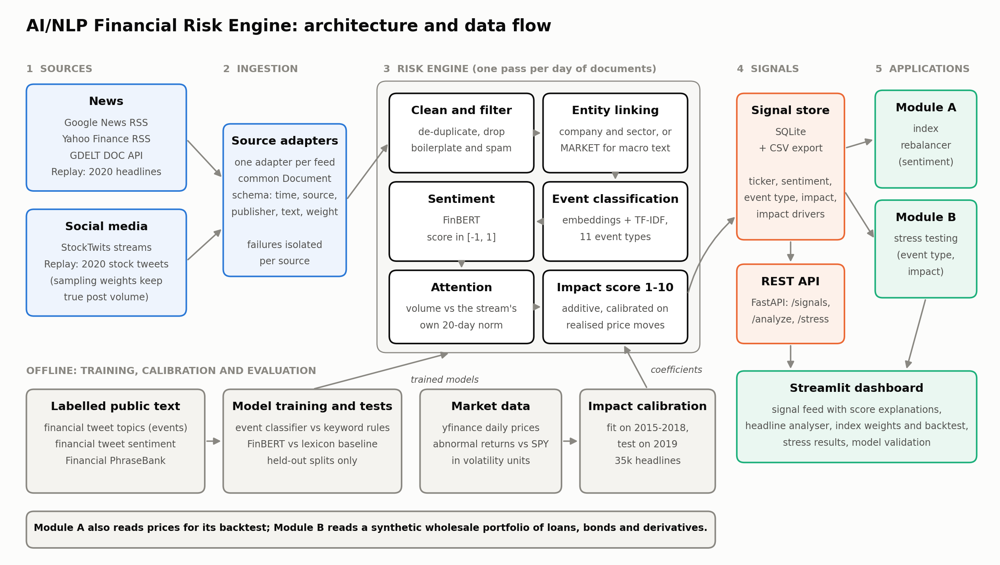

# AI/NLP Financial Risk Engine - S&P Global & Crisil Campus Hackathon

**Candidate Name:** Katariya Hemanth Kumar
**College Email ID:** hemanth_2301cs22@iitp.ac.in
**College / Campus:** Indian Institute of Technology Patna
**Demo Video Link:** [https://youtu.be/3NrrLFpfWEQ](https://youtu.be/3NrrLFpfWEQ) (YouTube, unlisted)
**Slide Deck:** [docs/presentation.pdf](docs/presentation.pdf)

## 1. Project Overview / Problem Statement & Approach

Risk teams read news and social media by hand, which is slow and inconsistent, and what they read never reaches the systems that hold positions. This project turns unstructured text into structured, machine-readable risk signals and then puts those signals to work in two applications.

The **risk engine** ingests news and social posts, works out which company (or the market as a whole) each one concerns, and emits one signal per document and company with three fields: a **sentiment score** from -1 to 1, an **event classification** across 11 event types, and an **impact score** from 1 to 10. The impact score is not a guess. It is an additive model fitted to how far prices actually moved after 35,000 past headlines, so every signal can show exactly why it scored the way it did.

Both downstream modules from the brief are built on the same signal feed. **Module A** tilts a mock 18-stock index toward stocks with better sentiment than their peers. **Module B** watches for clusters of high-impact systemic events and stress-tests a synthetic wholesale banking book of loans, bonds and derivatives. Everything runs locally on CPU with open models: no paid API is needed.

## 2. Architecture & Tech Stack



| Stage | What it does | How |
|---|---|---|
| Ingestion | One adapter per feed, all emitting the same `Document` | Replay: 2020 headlines and stock tweets. Live: Google News RSS, Yahoo Finance RSS, GDELT, StockTwits |
| Clean and filter | De-duplicates; drops fund-holdings disclosures, adverts and ticker-spam | Regex rules in `nlp/text.py` |
| Entity linking | Maps text to a ticker and sector, or to `MARKET` for macro text | Names for news, cashtags only for social; skips banks named only as the broker ("rating reaffirmed at JPMorgan") |
| Sentiment | Score in [-1, 1] | FinBERT (`ProsusAI/finbert`) |
| Event classification | 11 event types | MiniLM sentence embeddings + TF-IDF into logistic regression, plus a high-precision rule for credit events |
| Attention | Today's volume for a stream against its own 20-day norm | Raw volume for news; share of voice for social, where collection volume is not meaningful |
| Impact score | 1-10, with additive drivers | Ridge regression on realised abnormal price moves |
| Output | SQLite store, gzip CSV export, REST API | FastAPI: `/signals`, `/analyze`, `/index/weights`, `/stress/triggers`, `/stress/run` |
| Module A | Sentiment-tilted index | Smoothing, cross-sectional z-score, position limits, turnover budget, costs, one-day execution lag |
| Module B | Event-driven stress test | Scenario library scaled by impact; revaluation through rate, spread, equity, FX and commodity sensitivities and expected credit loss |
| Dashboard | Signal feed with score explanations, headline analyser, both modules, model validation | Streamlit + Plotly |

Source layout: `src/riskengine/` (engine, NLP, modules, API), `app/` (dashboard), `scripts/` (data, training, calibration, pipeline), `tests/` (45 tests).

## 3. Dataset Used

All data is public or synthetic. No proprietary or client data is used.

| File | Content | Source |
|---|---|---|
| `data/news.csv` | 1,783 headlines, Jan-Jun 2020, naming an index stock or the market | Hugging Face `ashraq/financial-news` (mirror of Kaggle "Daily Financial News for 6000+ Stocks") |
| `data/tweets.csv` | 30,137 stock tweets, Apr-Jul 2020 | Hugging Face `StephanAkkerman/stock-market-tweets-data` (CC BY 4.0) |
| `data/prices.csv` | Daily adjusted closes for the index, SPY and market proxies | Yahoo Finance via `yfinance` |
| `data/portfolio.csv` | 154 synthetic positions, $7.4bn | Generated by `scripts/generate_portfolio.py` (seeded) |
| `data/signals.csv.gz` | 40,896 signals: the engine's output for the replay window | Produced by `scripts/run_pipeline.py replay --export` |

Training and evaluation sets are downloaded by `scripts/download_data.py` and are not committed: `zeroshot/twitter-financial-news-topic` and `-sentiment` (MIT), Financial PhraseBank, and 2015-2019 headlines from the news set above for impact calibration.

Assumptions and caveats:

- **The brief's "provided sample transaction data" was not supplied**, and the suggested public transaction sets are retail card data. The wholesale portfolio is therefore synthetic: numbered placeholder counterparties, seeded random amounts, and default probabilities by rating that are illustrative values of the order published in long-run rating-agency studies.
- **News is stamped by date only**, so the engine cannot tell whether a headline came before or after the close. The backtest assumes the worst case (see section 5).
- **The news set is stock commentary** (Zacks, Investor's Business Daily, GuruFocus, TalkMarkets), not a newswire. Many headlines describe a move that has already happened.
- The tweet sample keeps at most 25 tweets per stock per day; each kept tweet carries a weight recording how many it stands for. Tweets are missing for 11-24 May 2020 in the source.
- One publisher's headlines arrive with the digits 0, 1 and 2 garbled in the source; `build_dataset.py` repairs them.

## 4. Quickstart & Installation

Runtime: Python 3.12 on Windows 11, CPU only (also expected to work on Linux and macOS).

```bash
git clone <your-repo-url>
cd <repo-folder>
pip install -r requirements.txt

# Load the committed engine output into the signal store (a few seconds)
python scripts/run_pipeline.py restore

# Dashboard
streamlit run app/dashboard.py

# REST API (optional), docs at http://localhost:8000/docs
uvicorn riskengine.api:app --port 8000

# Tests
pytest
```

The dashboard works immediately after `restore`. The first use of "Analyse a headline" or the live feed downloads FinBERT and MiniLM (about 500 MB) and takes about a minute to load.

Other entry points:

```bash
python scripts/run_pipeline.py live              # pull Google News, Yahoo Finance and StockTwits now and score them
python scripts/run_pipeline.py replay --export   # recompute every replay signal from the raw text

# Reproduce training and calibration from scratch (downloads about 620 MB of public data)
python scripts/download_data.py
python scripts/build_dataset.py
python scripts/train_events.py
python scripts/evaluate_sentiment.py
python scripts/prescore.py calibration 0/1
python scripts/calibrate_impact.py
```

Scoring text with FinBERT runs at roughly 15-20 documents per second on a laptop CPU, so a full replay from raw text takes about half an hour. Scores are cached on disk, and the committed `signals.csv.gz` means reviewers do not need to wait for that.

## 5. Key Results & Domain Impact

Every model is measured against a naive alternative on data it was not fitted on.

| Component | Naive approach | This project | Test set |
|---|---|---|---|
| Sentiment accuracy | 49.6% (VADER lexicon) | **71.6%** (FinBERT) | 2,388 financial tweets FinBERT never saw |
| Event classification accuracy | 54.7% (keyword rules) | **85.9%** | 3,368 held-out headlines |
| Impact vs realised price move, rank correlation per signal | 0.09 (sentiment strength alone) | **0.29** | 5,969 headlines from 2019, fitted on 2015-2018 |
| Chance of a two-sigma abnormal move, per stock-day | 8% (any day) | **38%** when impact is above 7 | 3,877 stock-days in 2019 |

FinBERT also scores 97% on Financial PhraseBank, but it was trained on that dataset, so that figure is not used as a headline. The Credit Event class is labelled by a rule, not by human annotation, and is excluded from the event accuracy.

**Module A: index rebalancer** (136 trading days, 2 Jan - 16 Jul 2020, net of 5 bp costs)

| | Return | Volatility | Max drawdown | Daily turnover |
|---|---|---|---|---|
| Sentiment-tilted index | +10.8% | 45.0% | -32.3% | 5.5% |
| Equal-weight index (same 18 stocks) | +11.2% | 47.0% | -33.7% | 0.9% |
| S&P 500 (SPY) | +0.7% | 43.0% | -33.7% | |

The tilt matched the equal-weight index with slightly lower volatility and drawdown; it did not beat it (information ratio -0.34). The reason is measurable: a day's sentiment lines up with that same day's return (rank correlation +0.10, t-stat 2.6), but against the return it can actually be traded into, the correlation is +0.003. In this sample, sentiment describes moves and does not forecast them. The backtest is deliberately conservative: sentiment seen on day t is traded at the close of t+1 and earns from t+2, because the news carries no time of day. Parameters were set once and not tuned to the result.

**Module B: stress testing.** Over the replay the engine triggered two stress tests, both on days of real market stress (VIX near 50, against a 33 average for the period):

| Date | Trigger | Impact | Scenario severity | Portfolio loss | Expected credit loss |
|---|---|---|---|---|---|
| 10 Mar 2020 (the day after the oil-price-war crash) | Market sell-off, 4 signals | 8.0 | 60% | -$162m (-2.2%) | $32.6m to $50.6m |
| 2 Apr 2020 (record US jobless claims) | Market sell-off, 4 signals | 7.5 | 50% | -$135m (-1.8%) | $32.6m to $47.5m |

Credit spreads are the largest loss driver in both (-$118m and -$98m), partly offset by gains on government bonds as yields fall. The dashboard's what-if mode runs any of the five scenarios at any impact score.

**Why it matters.** A credit or market risk analyst gets a ranked, explainable feed instead of a pile of headlines: each signal says which name, what kind of event, how negative, and how large a move such events have historically preceded. The same feed drives a portfolio view, so "what would this event cost us" has a number within the day, split by risk factor, sector and position. The impact score's drivers are fitted coefficients, not a black box, which is what a model-validation team would ask for first.

**Limitations**

- **Market-wide impact is not validated.** A separate fit on market-level headlines showed no relationship with S&P 500 moves in 2019 (rank correlation -0.01), so market-wide text reuses the single-company coefficients. The public headline set is stock commentary, not a macro newswire. This is the first thing to fix with a better feed.
- **Attention dominates the impact score.** Event type and tone add little once the volume of coverage is known. In this corpus many headlines are written after the move, so part of the two-day relationship is coincident; against the next day alone the rank correlation is 0.16 per signal.
- **Systemic event types rarely cluster.** The classifier labels crash-day headlines ("Dow plunges 2,000 points") as market commentary, so both triggers came through the market sell-off rule, not through the Geopolitical or Macroeconomic rules.
- **One short window.** Six months that include the COVID crash cannot establish a durable edge or its absence.
- **Sentiment is per document.** A headline naming two companies gives both the same score.
- **The stress model is a simplified sensitivity-based revaluation**, not a regulatory stress test: parallel shifts, no correlation between risk factors beyond what each scenario specifies, one-year default probabilities.
- A one-off poll of the live feeds has no volume history, so live signals use neutral attention and score lower than they would in a continuously running deployment.

**Next steps:** a time-stamped newswire or GDELT event feed for the market scope; aspect-level sentiment per company; a persistent live poller so attention is measured on live data; rating-migration and correlated shocks in the stress engine.


